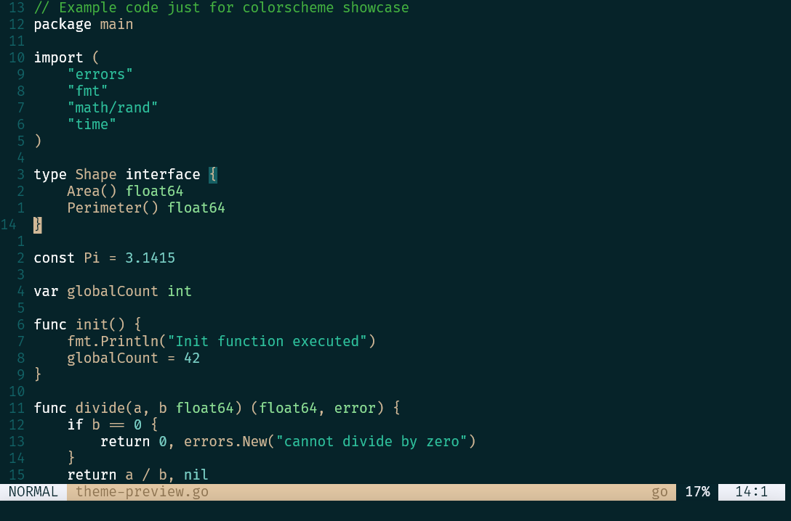

# naysayer.nvim

A dark green-blue Neovim colorscheme. It's a port of [Nick Aversano's Emacs theme](https://github.com/nickav/naysayer-theme.el) for Neovim, best known from Jonathan Blow's compiler livestreams.

## Showcase


## Installation

### Using Packer

```lua
use { 'RostislavArts/naysayer.nvim' }
```

### Using Lazy.nvim

```lua
{
  'RostislavArts/naysayer.nvim',
  priority = 1000,
  lazy = false,
  config = function()
    vim.cmd.colorscheme('naysayer')
  end,
}
````

## Usage

Inside `init.lua`
```lua
vim.cmd.colorscheme('naysayer')
```

## License

[GPL-3+](LICENSE) — same license as the original Emacs theme.

